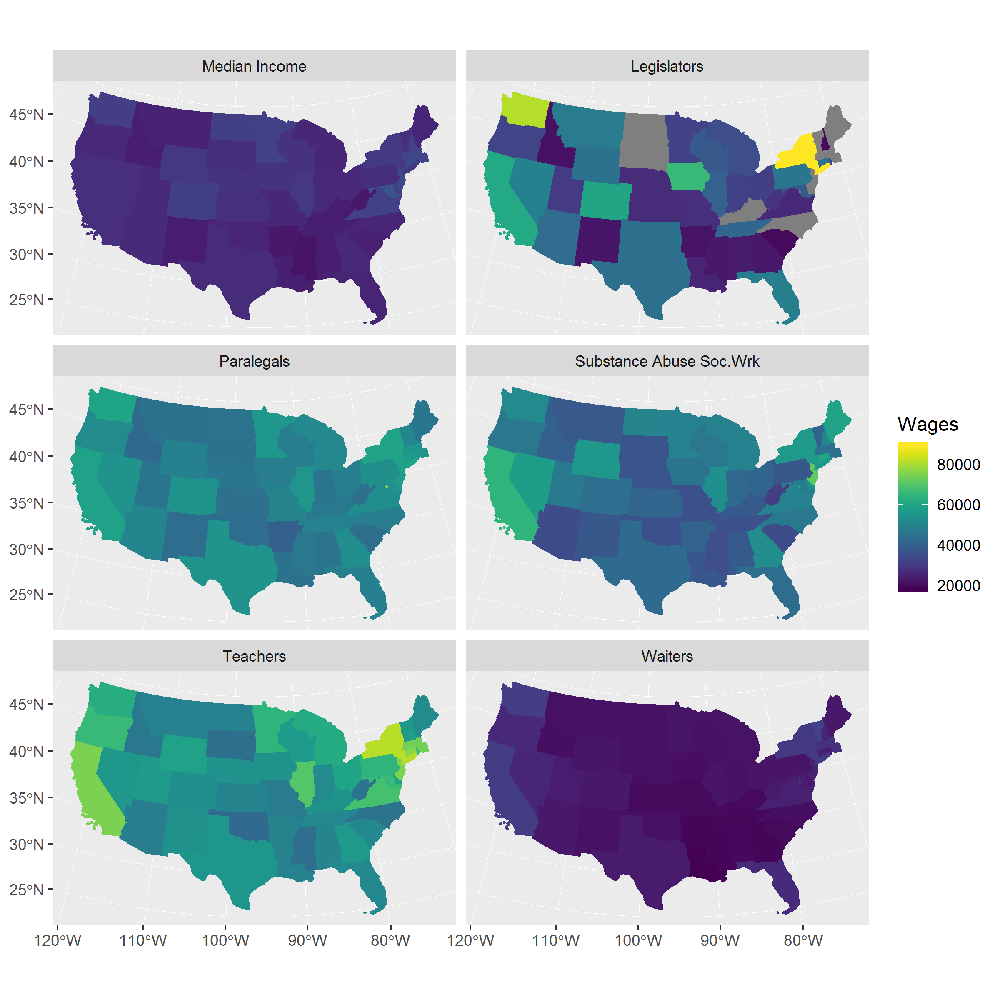

This example code

```{}
sf_data %>% 
  ggplot(aes(fill = Wages, color = Wages)) +
  geom_sf() +
  coord_sf(crs = 5070) +
  scale_fill_viridis(option = "viridis") + 
  scale_color_viridis(option = "viridis") +
  facet_wrap(~ category, nrow = 3, ncol = 2)
```

&nbsp;

Produced this faceted map  



Full disclosure.  The actual code was produced on the garbage-spaghetti plan.  The quality of the code is not something I'm proud of.  Therefore, I sanitized the code by showing the example,  above.  All the [actual code is available](038_facets_wrap_thematic_mapping.html).  You can explore and/or reproduce this process from the actual code, as you see fit.  If you don't mind, rewrite the code, using `purrr` then send me a cleaned and literate version.  'prec.
