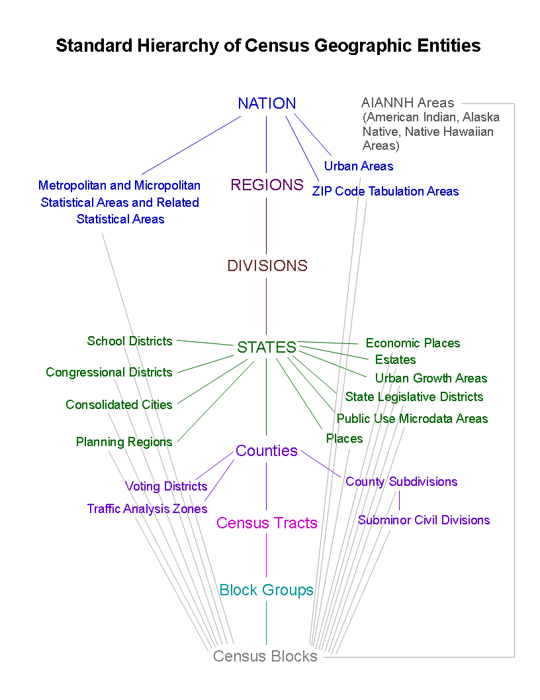
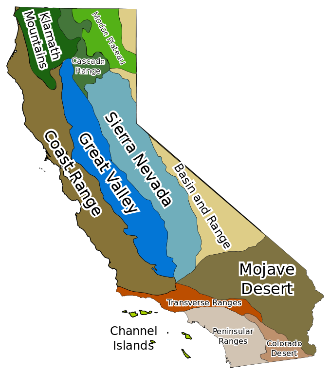

exclude: true

exmple of a test slide, not diplayed.  Next.

---
class: middle, center

Part 4 of the 
### [Rfun](http://rfun.library.duke.edu) Learning Series of Workshops
http://rfun.library.duke.edu

---
exclude: false
class: top, center
background-image:  url(http://library.duke.edu/data/sites/default/files/datagis/images/data_gis_logo.png)

## Data & Visualization Services
### [library.duke.edu/data](http://library.duke.edu/data)


&nbsp;  

&nbsp;  

&nbsp;  

&nbsp;  

&nbsp;  

&nbsp;  

&nbsp;  


[rfun.library.duke.edu/git/slides](http://rfun.library.duke.edu/git/slides/) <br>for slide annotations, keystroke: *P* 

???

This is a presenter comment for the presenter mode

use 'p' to toggle the presenter mode or '?' or 'h' to toggle the help / key-shortcut options

---
class: middle, center

### Hands-on and perhaps not purley intellectual

<iframe width="800" height="550"src="https://www.youtube.com/embed/MnKoQbFXemE" frameborder="0" allowfullscreen></iframe>

---
## Prequisites

- 023 Lab Workstions  (All packages and versions already installed)

- Intro to R:  Tidyverse, R Notebooks, R Markdown, RStudio

## Background Resources

- [Intro2r](https://rfun.library.duke.edu/intro2r/)
- [Reproducibility with git & RStudio](https://rfun.library.duke.edu/git/)
- [Visualization in R using ggplot2](https://github.com/amzoss/ggplot2-F17)
- [DVS learning materials: handouts, guides, data, and videos](http://library.duke.edu/data/news/past-workshops)

---
## Resources

- [Five great charts in 5 lines of R code each](https://www.r-bloggers.com/five-great-charts-in-5-lines-of-r-code-each/) by Sharon Maclis
- [TidyCensus](https://walkerke.github.io/tidycensus/) by Kyle Walker
- [Using tidycensus and leaflet to Map Census Data](https://juliasilge.com/blog/using-tidycensus/) by Julia Silge
- Sharon Maclis - [Mapping in R just got a whole lot easier](https://www.computerworld.com/article/3175623/data-analytics/mapping-in-r-just-got-a-whole-lot-easier.html)
- [Introduction to Spatial Data Types in R](https://cengel.github.io/rspatial/2_spDataTypes.nb.html#how-to-do-this-in-sf) by Claudia Engel
- DataCamp.com's [Working with Geospatial Data in R](https://www.datacamp.com/courses/working-with-geospatial-data-in-r) by Charlotte Wickham
- [Introduction to visualising spatial data in R](https://cran.r-project.org/doc/contrib/intro-spatial-rl.pdf). Lovelace, Cheshire, and Oldroyd
- [Simple Features for R](https://r-spatial.github.io/sf/index.html)
- [tmap in a nutshell](https://cran.r-project.org/web/packages/tmap/vignettes/tmap-nutshell.html)
- [viridis color pallettes](https://cran.r-project.org/doc/contrib/intro-spatial-rl.pdf)

---

## Outline

.pull-left[

1. Georeferencing with lat/lon points and leaflet

1. Choropleth with TidyCensus

1. Interactive Thematic Mapping with Simple Features

]

.pull-right[

<figure><figcaption> Image Credit: XKCD.  <a href="https://xkcd.com/1138/">HeatMap</a></figcaption></figure>

]
---
class: center, middle, softblue

## Georeferencing 

Plotting X/Y Coordinates (lattitude/longitude)

*leaflet*

---
class: center
background-image:  url(images/xy.png)

## 2012 Starbucks Locations in the Triangle

---


???
Image Credit: [GAO](https://www.flickr.com/photos/usgao/8269791489/)
---
class: center, middle, softblue

## Choropleth 

Shading areas with a variable 

*tidycensus* 

---
## Census

- ACS & Decennial Census

- Census Geography

---
background-image:  url(images/decennial_v_acs.jpg)

???

Census slide deck on [ACS](http://slideplayer.com/slide/10535013/)

---
class: center


???

https://www.census.gov/geo/reference/webatlas/

---
class: center, middle

## Polygons

---


???

https://commons.wikimedia.org/wiki/File:California_Geomorphic_Provinces.svg

---
## Census Variables

- https://walkerke.github.io/tidycensus/articles/basic-usage.html#searching-for-variables

- Social Explorer

- https://www2.census.gov/geo/tiger/TIGER_DP/2015ACS/Metadata/STATE_METADATA_2015.txt

---
class: center, middle, softblue

## Thematic Mapping

*tmap*

*sf*

*ggplot2*

---
##  Simple Features

- `sp()` - spatial polygons  (legacy)

- `sf()` - simple features (tidyverse compatible)

- [Conversion to and from `sp`](https://cran.r-project.org/web/packages/sf/vignettes/sf1.html#conversion-including-to-and-from-sp)

- Shapefiles

    - `st_read()`
    - `st_write()`
    - [sf vingette 2](https://cran.r-project.org/web/packages/sf/vignettes/sf2.html#using-st_read)

---
class: middle, green

## Save, Write, Output

- `leaflet` and/or `htmlwidgets` can

    - Read GeoJSON natively
    
    - Export a self contained HTML document
    
    - Integrate an HTML widget into an R Notebook

---
class: softblue, middle, center

## Markdown

---
.pull-left[

&nbsp;

&nbsp;

```

# Heading

## Sub-heading

### Another deeper heading
 
Text attributes 
 *italic*, **bold**, `monospace`.

A [link](http://example.com).

Bullet list:
- apples  
- oranges  
- pears  

Numbered list:
1. apples
2. oranges
3. pears
```
]

.pull-right[
# Heading
## Sub-heading

### Another deeper heading

*italicized*, **bold**, `monospace`

A [link](http://google.com)

Bullet list:
- applies
- oranges
- pears

Numbered list:
1. apples
2. oranges
3. pears

]

---
class: orange, middle, center

## **Reproducible Research** 

Integrate your reproducible workflow using *Literate Coding* practices in *R* then generate reports directly from analysis 

### R Notebooks + R Markdown + Git

???

This is where **Open** becomes **Awesome** 

---
## Packages

In order of appearance

.pull-left[- tidyverse

- leaflet

- tidycensus

- tigris

- sf

- stringr

- readxl]

.pull-right[- tmap

- tmaptools

- viridis

- devtools

- ggplot2 (latest version on github as of 9/27/2017)

- htmlwidgets
]

---
## Thank You For Attending

.pull-left[
### I am ...

- John Little
- https://johnlittle.info
- http://github.com/libjohn

#### Schedule Me

- [http:&#47;&#47;v.gd&#47;littleconsult](http://duke.libcal.com/appointment/2695)
]

.pull-right[
### We are...
- Data & Visualization Services
- http://library.duke.edu/data
- The /Edge, Bostock (1st Floor)

#### Walk-in Hours
- [Schedule](http://library.duke.edu/data/about/schedule)

#### Our Workshops
- [Current Workshops](http://library.duke.edu/data/news)
- [Past Workshops](http://library.duke.edu/data/news/past-workshops)

#### Contact Us
- askData@Duke.edu
]

---
class: center, middle
## Shareable 

Data, presentation, and handouts 

<span class="cc">
<!-- Key: a: SA, b: BY, c: CC Circle, d: ND, n: NC, m: Sampling, s: Share, r: Remix, C: CC Full Logo -->
C bn
</span>


[CC BY-NC license](https://creativecommons.org/licenses/by-nc/4.0/)